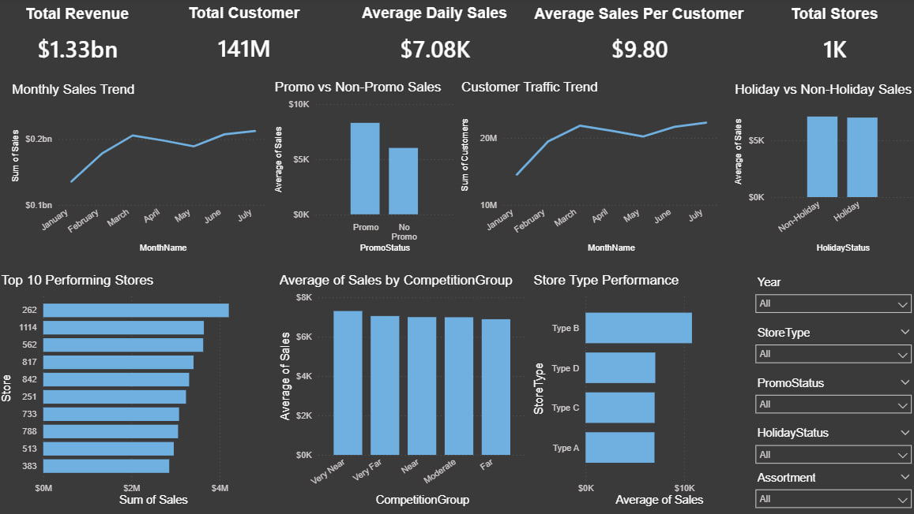

# Retail Demand Forecasting & Time Series Sales Analytics

## Project Overview
This project analyzes large-scale retail sales data from Rossmann stores to uncover time-based demand patterns, promotional effectiveness, customer traffic behavior, store performance, and competitive market impact.

The objective was to transform raw historical retail sales data into actionable business insights using data analytics, SQL querying, and business intelligence dashboards.

---

## Business Problem
Retail businesses need data-driven visibility into sales trends, promotions, customer behavior, and operational performance to optimize decision-making.

This project answers key business questions such as:

- When do peak sales occur?
- Do promotional campaigns significantly improve revenue?
- How does customer traffic change over time?
- Which store types perform best?
- Does nearby competition affect store sales?
- How do holiday periods influence business performance?

---

## Tech Stack
- Python
- Pandas
- NumPy
- Matplotlib
- Seaborn
- SQL (SQLite)
- Power BI

---

## Dataset
Rossmann Store Sales Dataset (Kaggle)

Files used:
- train.csv
- store.csv

Dataset includes:
- 1M+ retail sales records
- 1115 stores
- historical sales transactions
- customer traffic data
- promotional campaign indicators
- holiday flags
- competition distance data
- store metadata

Dataset Source:
https://www.kaggle.com/c/rossmann-store-sales

---

## Data Processing
Performed end-to-end data preparation including:

- data cleaning
- missing value handling
- dataset merging
- date conversion
- feature engineering
- SQL-based querying
- KPI generation
- dashboard-ready export creation

Feature engineering included:

- Year extraction
- Month extraction
- Day extraction
- Week-of-year generation
- weekend indicator creation
- sales per customer calculation
- promotion categorization
- holiday classification
- competition distance grouping

---

## Key KPIs
- **Total Revenue:** €1.33 Billion
- **Total Customers:** 141 Million
- **Average Daily Sales:** €7.08K
- **Average Sales per Customer:** €9.80
- **Total Stores:** 1115

---

## Exploratory Data Analysis
Performed analytical visualization and business exploration including:

- Monthly sales trend analysis
- Customer traffic trend analysis
- Promotion impact analysis
- Holiday sales comparison
- Store type performance analysis
- Top 10 revenue-generating store analysis
- Competition impact analysis
- Assortment-based sales analysis

---

## SQL Analysis
SQL queries were executed using SQLite to extract business insights such as:

- top-performing stores
- promotion effectiveness
- store-type performance
- holiday sales comparison
- monthly revenue patterns

---

## Key Business Insights

### Strong Seasonal Demand Patterns
Sales analysis revealed clear time-based fluctuations, with certain months consistently generating higher revenue.

### Promotions Improve Sales Performance
Promotional campaigns produced significantly higher average sales compared to non-promotional periods.

### Customer Traffic Varies Over Time
Customer visits showed strong monthly variation, reflecting changing retail demand behavior.

### Store Performance Differences
Top-performing stores significantly outperformed other branches, indicating operational or location-based performance gaps.

### Competition Influences Sales
Stores experienced measurable differences in sales performance depending on competitor proximity.

### Store Type Impacts Revenue
Different store formats showed clear variation in average sales outcomes.

### Holiday Periods Affect Purchasing Behavior
Holiday periods influenced customer spending and overall sales performance.

---

## Business Recommendations
Based on analytical findings:

- Expand promotions during weaker sales periods
- Optimize inventory before high-demand months
- Replicate best practices from top-performing stores
- Improve performance strategies for underperforming branches
- Use high-performing store formats for business expansion planning
- Design targeted seasonal campaigns
- Strengthen competitive pricing in dense market areas

---

## Dashboard Features
Interactive Power BI dashboard includes:

- KPI summary cards
- monthly sales trend
- customer traffic trend
- promotion impact analysis
- holiday sales analysis
- competition impact analysis
- top store performance analysis
- interactive slicer-based filtering

---

## Dashboard Preview


---

## Project Structure

```bash
Retail-Demand-Forecasting-Time-Series-Analytics/
│
├── notebook/
│   └── Retail_Demand_Forecasting_Time_Series_Analytics.ipynb
│
├── powerbi/
│   └── Retail_Demand_Forecasting_Time_Series_Analytics.pbix
│
├── visuals/
│   ├── dashboard_preview.png
│   ├── Monthly_Sales_Trend.png
│   ├── Promotion_Impact.png
│   ├── Customer_Traffic.png
│   ├── Competition_Impact.png
│   └── Top_Stores.png
│
└── README.md
```

---

## Future Improvements
- forecasting model integration
- advanced demand prediction
- cloud deployment
- automated reporting pipeline
- real-time retail monitoring

---

## Author
**Jayanth**
